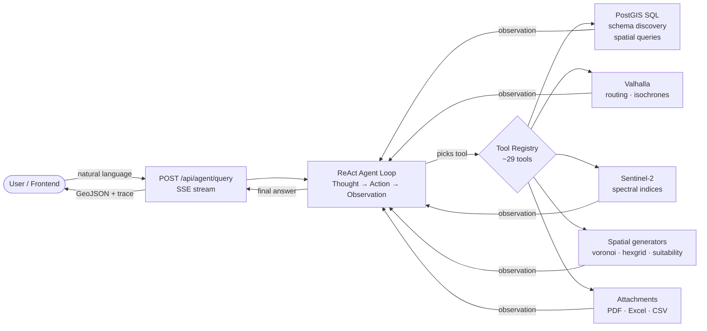

# Cognitive Geospatial Assistant

An LLM-powered agent that answers geospatial questions in natural language, returning interactive maps and exportable GeoJSON.


## Demo

[](https://www.youtube.com/watch?v=NA19nn7qcLs)

> Ask in plain English. Get walking routes, distances, restaurants, hospitals & more — instantly.
> No dropdowns. No filters. Just answers. Export results as GeoJSON for deeper GIS analysis.

## Overview

Ask a geospatial question in plain English and get an interactive map back. A ReAct-style agent decides which tools to call (PostGIS SQL, Valhalla routing, isochrones, satellite indices, spatial generators, scenario simulation) and streams its reasoning and results to the frontend over Server-Sent Events. Bring your own data: drop tables into PostGIS and the agent picks them up automatically through schema introspection.

## Features

- **Natural language → map** — type a question, see the answer rendered on Leaflet
- **Tool-using agent** — ~29 typed tools the LLM can compose (SQL, routing, isochrones, spectral indices, scoring, geometry generation, scenario compare)
- **Spatial generators** — voronoi, hexgrid, convex hull, corridor, kernel density, site suitability, coverage gaps, equity gaps
- **Scenario planning** — add hypothetical features (e.g. "what if we put a hospital here?") and compare baseline vs scenario metrics
- **Attachments in chat** — upload PDFs and Excel/CSV files; the agent reads them inline as part of an answer
- **Auto-discovered schema** — new PostGIS tables are catalogued automatically and become queryable with no code change
- **Multi-LLM** — DeepSeek (default), Google Gemini, Ollama, or LM Studio (fully offline)
- **Routing & isochrones** — Valhalla pedestrian / cycling / driving routes and reachability polygons
- **Satellite analysis** — Sentinel-2 NDVI/EVI/SAVI/NDWI/NDBI computed against any drawn or table-defined area
- **REST + Docker** — FastAPI with Swagger docs; full stack via `docker-compose`

## Architecture



The agent loop is a single endpoint: tools execute, results feed back to the LLM, the loop continues until a final GeoJSON answer is produced. Every run is persisted as a trace in Postgres for replay.

## Tech Stack

| Component | Technology |
|-----------|------------|
| API | FastAPI + SSE streaming |
| Agent loop | ReAct orchestrator (`app/utils/agent_orchestrator.py`) |
| LLMs | DeepSeek · Google Gemini · Ollama · LM Studio |
| Spatial DB | PostgreSQL + PostGIS, pgRouting |
| Routing | Valhalla |
| Geocoding | Nominatim (self-hosted) |
| Vector ops | GeoPandas, Shapely |
| Satellite | Sentinel-2 (rasterio) |
| Frontend | Leaflet, vanilla JS |

## Quick Start

**Prerequisites:** Python 3.11+, Docker & Docker Compose, a DeepSeek API key (or Ollama / LM Studio for local-only)

```bash
# 1. Clone and set up environment
conda create -n geoassist python=3.11 && conda activate geoassist
pip install -r requirements.txt

# 2. Configure environment
cp .env.example .env
# Add DEEPSEEK_API_KEY (or point at Ollama / LM Studio for local LLMs)

# 3. Start PostGIS, Valhalla, Nominatim (first run downloads Berlin OSM data)
docker-compose up -d postgis valhalla nominatim

# 4. Run the API
python -m uvicorn app.main:app --reload
```

- Frontend: http://localhost:8000
- API docs (Swagger): http://localhost:8000/docs

## Example Queries

```
"Find hospitals within 2 km of flood zones in Berlin"
"Show universities near public transport stops"
"Top 5 locations for a veterinary clinic in Marzahn-Hellersdorf"
"Walking-distance restaurants from Alexanderplatz"
"NDVI change in Tiergarten between summer 2023 and summer 2024"
"What if we added a new metro stop here — how does coverage change?"
"Coverage gaps for pharmacies in Mitte (>500 m from any pharmacy)"
```

## API Usage

The agent endpoint streams Server-Sent Events. Each event is one step of the ReAct loop; the final event carries the GeoJSON answer.

```bash
curl -N -X POST "http://localhost:8000/api/agent/query" \
  -H "Content-Type: application/json" \
  -d '{"question": "Find hospitals within 2 km of flood zones in Berlin"}'
```

For one-shot integrations, ignore intermediate events and consume only the final `event: done` payload.

## Data Coverage

24+ OSM vector datasets covering Berlin (~45,000 features): hospitals, pharmacies, schools, universities, restaurants, parks, transport stops, supermarkets, parking, districts, and more. Additional layers can be ingested directly into PostGIS — the agent will discover them automatically.

See [`docs/DATA_SOURCES.md`](docs/DATA_SOURCES.md) for the full dataset list.

## Documentation

- [Quick Start Guide](docs/guides/QUICKSTART.md)
- [Setup Guide](docs/guides/SETUP_GUIDE.md)
- [Troubleshooting](docs/guides/TROUBLESHOOTING.md)
- [Data Sources](docs/DATA_SOURCES.md)

## Contributing

Contributions welcome — fork, branch, add tests, submit a PR.

## License

MIT — see `LICENSE`.

## Author

**Sk Fazla Rabby**
MSc Geodesy & Geoinformation Science — AI-driven geospatial data integration and analysis

## Open Source Acknowledgments

Built on top of:

| Project | Use |
|---------|-----|
| [Valhalla](https://github.com/valhalla/valhalla) | Multi-mode routing + isochrones |
| [Nominatim](https://github.com/osm-search/Nominatim) | Self-hosted OSM geocoding |
| [PostGIS](https://postgis.net) · [pgRouting](https://pgrouting.org) | Spatial database + graph routing |
| [OpenStreetMap](https://www.openstreetmap.org) · [Geofabrik](https://download.geofabrik.de) | Primary geospatial data |
| [ODIS WFS Explorer](https://github.com/technologiestiftung/odis-wfsexplorer) | Reference for Berlin WFS ingest |
| [GeoPandas](https://geopandas.org) · [Shapely](https://shapely.readthedocs.io) | Vector processing |
| [RDFLib](https://rdflib.readthedocs.io) | RDF/SPARQL endpoint |
| [Leaflet](https://leafletjs.com) · [Turf.js](https://turfjs.org) | Frontend mapping |
| [FastAPI](https://fastapi.tiangolo.com) | REST + SSE framework |
| [DeepSeek](https://deepseek.com) · [Google Gemini](https://ai.google.dev) · [Ollama](https://ollama.com) · [LM Studio](https://lmstudio.ai) | LLM providers |
| [Claude Code](https://claude.ai/claude-code) | Development assistance |
