# Cognitive Geospatial Assistant API

An LLM-Integrated RESTful API for Interactive Geospatial Reasoning and Querying


## Demo

[](https://www.youtube.com/watch?v=NA19nn7qcLs)

> Ask in plain English. Get walking routes, distances, restaurants, hospitals & more — instantly.
> No dropdowns. No filters. Just answers. Export results as GeoJSON for deeper GIS analysis.

## Overview

The Cognitive Geospatial Assistant API lets you query and analyze geospatial datasets using natural language. It integrates **DeepSeek, Google Gemini, and Ollama LLMs** alongside a **6-phase AI pipeline** and a **Semantic Knowledge Graph** to translate plain-English questions into spatial operations, returning GeoJSON results on an interactive map.

## Features

- **Natural Language Queries** — Ask geospatial questions in plain English
- **LLM-Powered Reasoning** — DeepSeek, Gemini, and Ollama translate queries to spatial operations
- **6-Phase AI Pipeline** — Structured query processing from intent detection to result evaluation
- **Business Intelligence Layer** — Auto-loads structured site-selection profiles (legal zones, building type filters, competitor exclusion, scoring weights) for any business type before SQL generation
- **Knowledge Graph (BauNVO)** — 46 triples encoding German planning law stored in `metadata.knowledge_graph`; legal zone rules are injected into every site-selection prompt automatically
- **Schema Auto-Discovery** — New PostGIS tables are catalogued by AI with zero code changes; the system picks them up immediately
- **Semantic Knowledge Graph** — RDF/OWL ontology matches query intent to the right tables
- **Valhalla Routing** — Accurate pedestrian/cycling/auto routing and walking distance calculations
- **Intelligent Site Selection** — Find optimal business locations with legal-zone filtering, competitor exclusion, and distance-decay MCDA scoring
- **Local LLM Support** — Ollama backend (qwen3.5:9b) as a fully offline alternative to cloud APIs
- **Interactive Map Viewer** — Leaflet-based frontend for result visualization
- **RESTful API + Docker** — FastAPI with Swagger docs; full stack deployable via docker-compose

## Pipeline Architecture

Every query passes through six structured phases. Phases 0, Execution, and 5 involve no additional LLM calls — only the three reasoning phases (1+2, 3, 4) hit the API.

```mermaid
flowchart TD
    Q["User Question\n(natural language)"] --> FE["Frontend\nLeaflet Map"]
    FE -->|"POST /api/query"| API["FastAPI\n/api/query"]

    API --> P0

    subgraph P0["Phase 0 — Business Intelligence"]
        direction TB
        P0A["Detect business type\n(keyword match)"] --> P0B["Lookup vector.business_profiles\n(legal zones · bezgfk · competitor radius · weights)"]
        P0B --> P0C["Query metadata.knowledge_graph\n(BauNVO permitted / prohibited zones)"]
        P0C --> P0D["Format profile section\n→ injected into system prompt"]
    end

    P0 --> P12

    subgraph P12["Phase 1+2 — Table Selection + Schema"]
        direction TB
        P12A["LLM scans metadata.table_descriptions\n(auto-discovered catalog)"] --> P12B["Fetch full schema for\nselected tables only"]
    end

    P12 --> P3

    subgraph P3["Phase 3 — Query Planning"]
        direction TB
        P3A["LLM validates filters\nagainst real column values"] --> P3B["Produces confirmed_tables\n+ filter_plan JSON"]
    end

    P3 --> P4

    subgraph P4["Phase 4 — SQL Generation"]
        direction TB
        P4A["DeepSeek / Gemini / Ollama"] --> P4B["Generates PostGIS SQL\n(Legal A + §34 · bezgfk filter · competitor exclusion · MCDA scoring)"]
    end

    P4 --> EX

    subgraph EX["Execution — PostGIS"]
        direction TB
        EXA["SQL → PostGIS\n(ST_DWithin · ST_Intersects · CTE scoring)"] --> EXB["→ GeoJSON FeatureCollection"]
    end

    EX --> P5

    subgraph P5["Phase 5 — Result Evaluation"]
        direction TB
        P5A["Rule-based quality check\n(clustering · building type mismatch · empty results)"] --> P5B{"Pass?"}
        P5B -->|"Yes"| OK["Return results"]
        P5B -->|"No"| WARN["Surface issues + warnings"]
    end

    P5 --> FE2["Frontend\nMap layer + export"]
```



| Phase | Name | What it does | LLM call? |
|-------|------|-------------|-----------|
| 0 | Business Intelligence | Detects business type; loads profile + KG facts; injects into prompt | No (DB lookup) |
| 1+2 | Table Selection + Schema | LLM selects relevant tables from auto-discovered catalog; fetches full schema | Yes |
| 3 | Query Planning | LLM validates filters using real column values from Phase 2 | Yes |
| 4 | SQL Generation | LLM produces PostGIS SQL with legal filters, bezgfk filters, MCDA scoring | Yes |
| EX | Execution | SQL runs against PostGIS; GeoJSON FeatureCollection returned | No |
| 5 | Result Evaluation | Rule-based quality check (geographic clustering, building type, empty results) | No |

## Tech Stack

| Component | Technology |
|-----------|------------|
| API | FastAPI |
| LLMs | DeepSeek, Google Gemini 2.5 Flash |
| Local LLM | Ollama (qwen3.5:9b) |
| Knowledge Graph | RDFLib, SHACL, SPARQL + BauNVO triples |
| Business Intelligence | `vector.business_profiles`, `metadata.knowledge_graph` |
| Schema Auto-Discovery | AI-powered table cataloguing (DeepSeek) |
| Routing | Valhalla |
| Spatial DB | PostGIS, pgRouting |
| Vector Processing | GeoPandas, Shapely |
| Frontend | Leaflet, HTML/JS |

## Quick Start

**Prerequisites:** Python 3.11+, Docker & Docker Compose, DeepSeek API key

```bash
# 1. Clone and set up environment
conda create -n geoassist python=3.11 && conda activate geoassist
pip install -r requirements.txt

# 2. Configure environment
cp .env.example .env
# Add DEEPSEEK_API_KEY (and optionally GEMINI_API_KEY) to .env

# 3. Start PostGIS + Valhalla (first run downloads Berlin OSM data, ~3-5 min)
docker-compose up -d postgis valhalla

# 4. Run the API
python -m uvicorn app.main:app --reload

# 5. (Optional) Set up Business Intelligence tables
python scripts/setup_business_intelligence.py
```

- Frontend: http://localhost:8000
- API Docs: http://localhost:8000/docs

## Example Queries

```
"Find hospitals within 2km of flood zones in Berlin"
"Show universities near public transport stops"
"Where should I open a pharmacy near hospitals in Mitte?"
"Find restaurants within walking distance of Alexanderplatz"
"Which district has the highest concentration of schools?"
"Find top 5 locations for a veterinary clinic in Marzahn-Hellersdorf"
"Where should I open a pharmacy in Mitte — legally viable locations only?"
```

## API Usage

```bash
curl -X POST "http://localhost:8000/api/query" \
  -H "Content-Type: application/json" \
  -d '{"question": "Find hospitals within 2 km of flood zones in Berlin"}'
```

## Data Coverage

**24 OSM vector datasets** covering Berlin (~45,000+ features): hospitals, pharmacies, schools, universities, restaurants, parks, transport stops, supermarkets, parking, districts, and more.

**Business Intelligence**: `vector.business_profiles` (8 business types pre-seeded), `metadata.knowledge_graph` (46 BauNVO triples encoding German zoning law).

See [`docs/DATA_SOURCES.md`](docs/DATA_SOURCES.md) for the full dataset list and external data sources.

## Documentation

- [Quick Start Guide](docs/guides/QUICKSTART.md)
- [Setup Guide](docs/guides/SETUP_GUIDE.md)
- [Troubleshooting](docs/guides/TROUBLESHOOTING.md)
- [Implementation Plan](docs/implementation/IMPLEMENTATION_PLAN.md)

## Contributing

Contributions welcome — fork, branch, add tests, submit a PR.

## License

MIT License — see LICENSE file for details.

## Author

**Sk Fazla Rabby**
MSc in Geodesy and Geoinformation Science — AI-driven geospatial data integration and analysis

## Open Source Acknowledgments

This project is built on the shoulders of these excellent open source projects:

### Routing & Geocoding
| Project | Purpose |
|---------|---------|
| [Valhalla](https://github.com/valhalla/valhalla) | Multi-mode routing engine (pedestrian, cycling, auto) with isochrone support |
| [Nominatim](https://github.com/osm-search/Nominatim) | Self-hosted OpenStreetMap geocoding — forward, reverse, and autocomplete |

### Data Sources & Tooling
| Project | Purpose |
|---------|---------|
| [OpenStreetMap](https://www.openstreetmap.org) | Primary geospatial dataset for all Berlin features |
| [Geofabrik](https://download.geofabrik.de) | OSM PBF download mirror used for Berlin data |
| [ODIS WFS Explorer](https://github.com/technologiestiftung/odis-wfsexplorer) by Technologiestiftung Berlin | Reference implementation for fetching official Berlin open data via WFS endpoints |

### Spatial Database
| Project | Purpose |
|---------|---------|
| [PostGIS](https://postgis.net) | PostgreSQL extension for storing and querying vector geometry |
| [pgRouting](https://pgrouting.org) | Graph routing extension (Dijkstra fallback when Valhalla is unavailable) |

### Semantic Web & Knowledge Graph
| Project | Purpose |
|---------|---------|
| [RDFLib](https://rdflib.readthedocs.io) | RDF/OWL ontology management and SPARQL queries |
| [pySHACL](https://github.com/RDFLib/pySHACL) | SHACL shape validation for geospatial ontologies |
| [owlready2](https://owlready2.readthedocs.io) | OWL 2 ontology API for class and property management |

### Geospatial Processing
| Project | Purpose |
|---------|---------|
| [GeoPandas](https://geopandas.org) | Vector geospatial data frames and analysis |
| [Shapely](https://shapely.readthedocs.io) | Geometric operations (buffers, intersections, unions) |

### Frontend & Visualization
| Project | Purpose |
|---------|---------|
| [Leaflet](https://leafletjs.com) | Interactive web mapping and layer management |
| [Turf.js](https://turfjs.org) | Browser-side spatial analysis (distance, bbox, buffer) |

### Backend & LLMs
| Project | Purpose |
|---------|---------|
| [FastAPI](https://fastapi.tiangolo.com) | REST API framework with automatic Swagger docs |
| [DeepSeek](https://deepseek.com) | Primary LLM for natural language → SQL translation |
| [Google Gemini](https://ai.google.dev) | Secondary LLM option (Gemini 2.5 Flash) |
| [Ollama](https://ollama.com) | Local LLM runtime for fully offline operation |

### Development Tools
| Tool | Purpose |
|------|---------|
| [Claude Code](https://claude.ai/claude-code) by Anthropic | Partial code generation and development assistance used during implementation |
